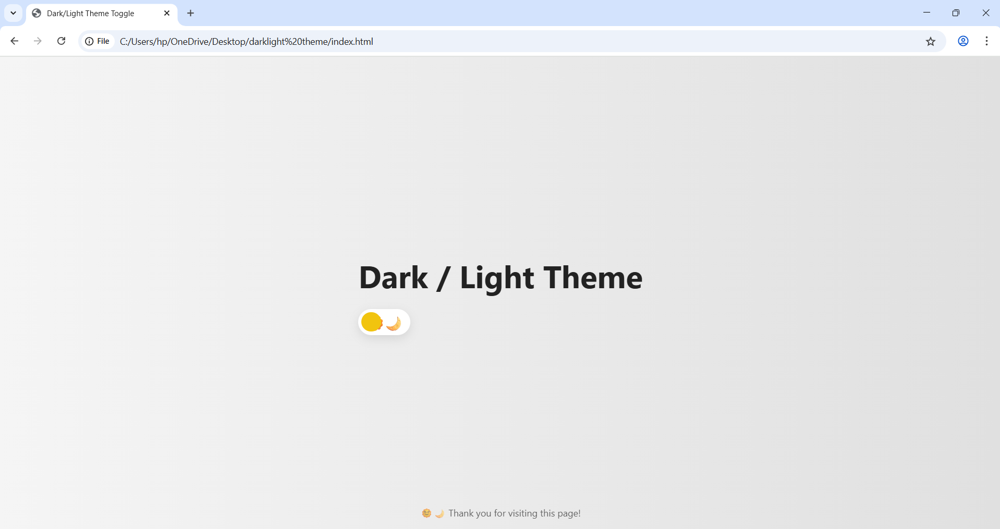
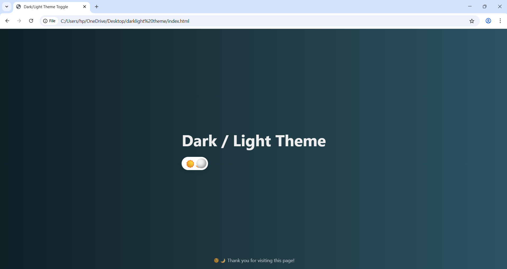

# 🌞🌙 Dark/Light Theme Toggle Website

A creative and interactive website featuring a smooth dark/light mode toggle with cool sun/moon animations and gradient background transitions. Built with pure HTML, CSS, and JavaScript — no frameworks or libraries needed.

## 🖼️ Preview

## ✨ Features

- 🌞 Light & 🌙 Dark Theme Support
- ⚡ Smooth background and icon transition
- ☀️ Sun/Moon animated toggle button
- 💻 Responsive design for all screen sizes
- 🎨 Minimalistic UI with a creative feel

## 🚀 Live Demo

[🔗 Click here to view the live demo](_)

## 🛠️ How to Use

1. Clone the repository or download the `index.html` file.
2. Open it in any browser.
3. Click the toggle button to switch between light and dark themes!

## 🧠 Customization Ideas

- Add twinkling stars in dark mode using CSS keyframes.
- Save the selected theme using `localStorage`.
- Add background sound effects on toggle.
- Turn it into a React/Vue component.

## 📬 Feedback

If you liked it or want more cool UI elements like this, feel free to connect or contribute!

## 📜 License

This project is open-source and free to use under the [MIT License](LICENSE).
